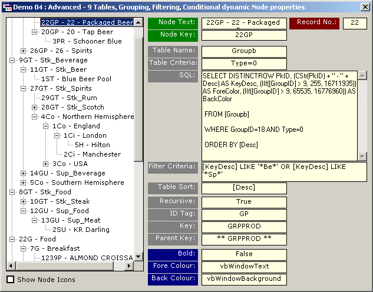



## cADOTreeView \(Initial Beta Release\)

### Description

TreeView control is one of the most overlooked controls by developers for use in database applications to display picklists. This is mainly due to the lack of data binding and time required to code. This wrapper does it for you!

It simplifies the display of complex data relationships using ADO and the TreeView control. I've made it as generic and flexible as possible whilst significatly improving loading performance over manually coded methods. Features include:-

--- Loading records on an "as-needed" basis when Nodes are expanded (includes optional control over the expanding of Nodes) - significatly reduces load time.

--- Simple and complex data relationships with support for:-

a). recursive record linking;

b). many-2-one data relationships;

c). one record can be displayed multiple times - each instance of the same record can be fully customised i.e. different images, colors, etc...;

d). unlimited data relationships and nesting levels.

--- "A pictures is worth a thousand words!" - color coded ranges; Images as warning indicators; color coded regions, etc... Built-in automatic support for customisation of *ALL* Node display properties on a "Per Record" basis - NO MANUAL CODING REQUIRED! (Does not use the .Tag property of each Node - does anyone want this property automatically filled?)

--- User defined sorting - uses the SQL "ORDER BY" clause instead of each Node's .Sort property

--- Custom filter criterias

--- Persistance of data relationships (with associated icons). This gives several benefits: -

a). the defined relationship is portable and can be stored in the registry, as a resource, record in the database, or to disk (in-built function);

b). Bind your database to the treeview control with only 3 lines of code when using a persisted data relationship!

c). Can copy any part (or all) of data relationships between different instances using the .Contents property;

d). any modification to icons or filtering can be persisted allowing progmatic or user customisation between sessions &/or applications, users, etc...

o ... Load-on-Demand (using its own wrapper class) is exposed for use with other non-ADO bound TreeView Controls within your application.

It's very easy to Use the wrapper - Define a data relationship, point to the Database, and then the wrapper will do the rest.

The zip file includes: all source codes, VBADOTree.Dll, Five (6) demonstration applications ranging from simple implementation of the Load-on-demand feature (non-ADO Demo) through to a complex inter-table relationship (9 tables) with recursive data structures, custom filter criterias, non-alphanumeric (custom user-defined) sorting, and conditional node properties.

Both the Wrapper DLL and demonstration applications are fully commented. Demonstration applications also include very detailed comments and notes on how the data binding and automatic SQL building actually works. This should make implementation in your own projects very easy.
 
### More Info
 

             |
---                |---
**Submitted On**   |2003-07-15 18:03:20
**By**             |[Slider](https://github.com/Planet-Source-Code/PSCIndex/blob/master/ByAuthor/slider.md)
**Level**          |Intermediate
**User Rating**    |5.0 (215 globes from 43 users)
**Compatibility**  |VB 6\.0
**Category**       |[Databases/ Data Access/ DAO/ ADO](https://github.com/Planet-Source-Code/PSCIndex/blob/master/ByCategory/databases-data-access-dao-ado__1-6.md)
**World**          |[Visual Basic](https://github.com/Planet-Source-Code/PSCIndex/blob/master/ByWorld/visual-basic.md)
**Archive File**   |[cADOTreeVi1615637162003\.zip](https://github.com/Planet-Source-Code/slider-cadotreeview-initial-beta-release__1-46955/archive/master.zip)

